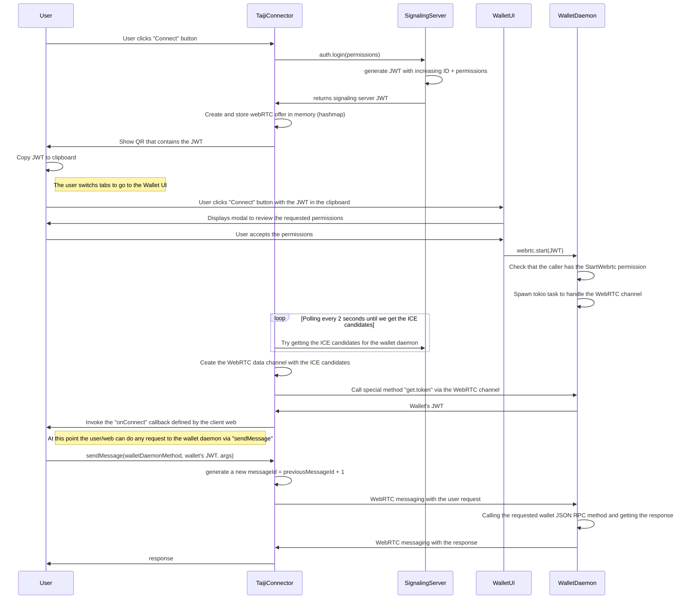

# Wallet sequence diagram

```mermaid
sequenceDiagram
participant User
participant TaijiConnector
participant SignalingServer
participant WalletUI
participant WalletDaemon

User->>TaijiConnector: User clicks "Connect" button
TaijiConnector->>SignalingServer: auth.login(permissions)
SignalingServer->>SignalingServer: generate JWT with increasing ID + permissions
SignalingServer->>TaijiConnector: returns signaling server JWT
TaijiConnector->>TaijiConnector: Create and store webRTC offer in memory (hashmap)
TaijiConnector->>User: Show QR that contains the JWT 
User->>User: Copy JWT to clipboard

note right of User: The user switchs tabs to go to the Wallet UI

User->>WalletUI: User clicks "Connect" button with the JWT in the clipboard
WalletUI->>User: Displays modal to review the requested permissions
User->>WalletUI: User accepts the permissions
WalletUI->>WalletDaemon: webrtc.start(JWT)
WalletDaemon->>WalletDaemon: Check that the caller has the StartWebrtc permission
WalletDaemon->>WalletDaemon: Spawn tokio task to handle the WebRTC channel

loop Polling every 2 seconds until we get the ICE candidates
    TaijiConnector->>SignalingServer: Try getting the ICE candidates for the wallet daemon
end
TaijiConnector->>TaijiConnector: Ceate the WebRTC data channel with the ICE candidates
TaijiConnector->>WalletDaemon: Call special method "get.token" via the WebRTC channel
WalletDaemon->>TaijiConnector: Wallet's JWT
TaijiConnector->>User: Invoke the "onConnect" callback defined by the client web

note right of User: At this point the user/web can do any request to the wallet daemon via "sendMessage"

User->>TaijiConnector: sendMessage(walletDaemonMethod, wallet's JWT, args)
TaijiConnector->>TaijiConnector: generate a new messageId = previousMessageId + 1
TaijiConnector->>WalletDaemon: WebRTC messaging with the user request
WalletDaemon->>WalletDaemon: Calling the requested wallet JSON RPC method and getting the response
WalletDaemon->>TaijiConnector: WebRTC messaging with the response
TaijiConnector->>User: response
```